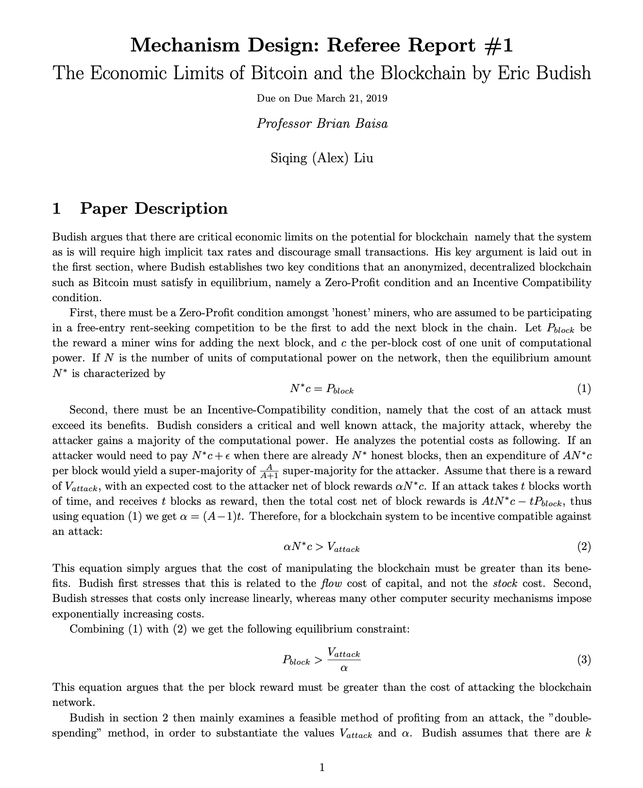
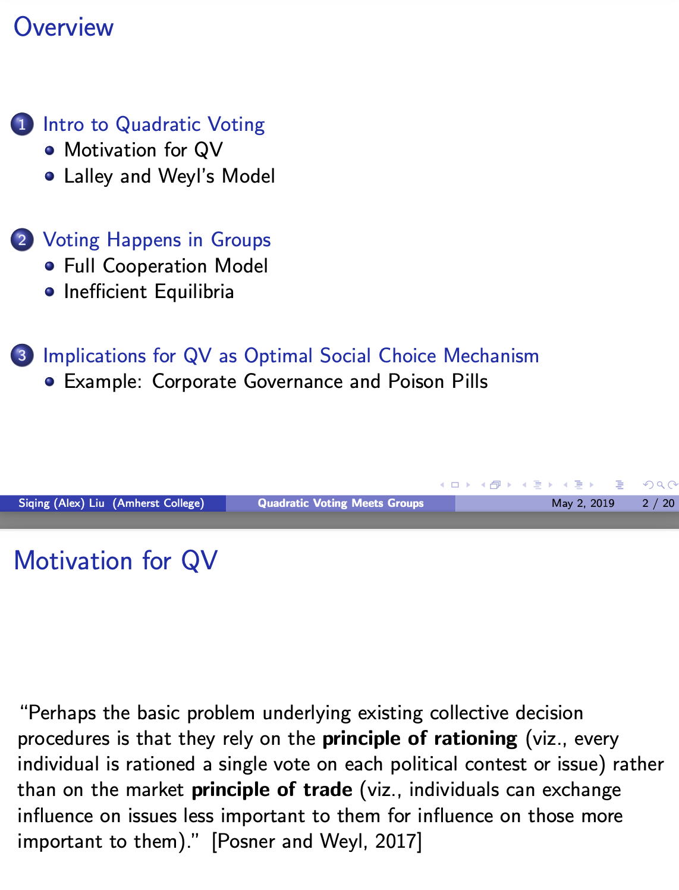

# ECON 470: Mechanism Design
### Professor Brian Baisa
Course Content: Economics 470 is an advanced undergraduate course in mechanism design. Mechanism design is a subfield of game theory. Game theory seeks to understand how people behave in strategic settings. Mechanism design then uses insights from game theory to ask how should we design strategic settings. We will study mechanism design with an emphasis on microeconomic applications.

A large portion of the course will use mechanism design to study how buyers and sellers interact. We will study models that argue that certain commonly studied market forms (auctions, monopoly pricing, perfect competition) are emergent because these simple mechanisms are the endogenous solution to a complex mechanism design problem. We will also use mechanism design to understand why some market structures function imperfectly and how/when/if it is possible to improve on market outcomes. We then will use the tools developed to study markets in order to study non-market settings like voting, matching theory, and the distribution of public goods.

## Review of The Economic Limits of Bitcoin and the Blockchain by Eric Budish
[Link](../mechanism-design-bitcoin.pdf) to full pdf.

## Quadratic Voting Meets Groups
[Link](../mechanism-design-qv-paper.pdf) to full pdf.
[Link](../mechanism-design-qv-slides.pdf) to slides pdf.

### Introduction
Quadratic Voting is a voting mechanism proposed by Glenn Weyl [Posner and Weyl, 2017] The mechanism is intended to be a balance between one-person-one-vote democracy and a market, where those who value the good more receive more of it. It is designed such that collective decisions can incorporate intensity of preference, and to incentivize true reporting of preferences.
Weyl argues that not only is QV more efficient than a 1p1v democracy, it is also more robust to fraud and collusion than alternative social choice mechanisms such as VCG. However, Weyl’s uses asymptotic efficiency to argue for robustness, which is only effective in large populations. This assumption may hold in the commonly envisioned setting for QV, which are large public elections. However, Weyl and Posner advocate for QV in far more intimate settings, as demonstrated by their paper Quadratic Voting as Efficient Corporate Governance. [Posner and Weyl, 2014] In an article in the New York Times, How to Make Poison Pills Palatable [Posner and Weyl, 2013], they argue that QV is a more efficient method to protect management from shareholder passivity during hostile takeovers by activist investors.
Two polarized groups breaks down many of assumptions underlying QV’s robustness. I focus on one possible violation - coordination within groups. The model I build assumes two competing, homogeneous groups which can perfectly coordinate voting internally. I demonstrate that the equilibrium in which both groups vote inefficiently privileges larger groups. This leads to a situation similar to a tyranny of the majority, whereby even if it is more efficient for the minority, or the smaller group, to win the vote, the larger group may win due to their size advantage. This is an outcome that QV intends to avoid, as it incorporates preference intensity in order to allow minorities to express strong preferences and override the majority.
First, in sections 2 and 3, I explain Lalley and Weyl’s core rationale for QV, and try to summarize, by Weyl’s own admission what: “LW also show that proving the properties of the QV equilibria fully formally requires a rich statistical machinery; even in the simple environment they study the proof of their main theorem involves forty pages of dense mathematics.” [Weyl, 2017]
However, in smaller settings, especially over divisive issues, the possibility of voting in dichotomous groups becomes non-negligible. In Section 4, I qualitatively detail how group voting violates the assumptions