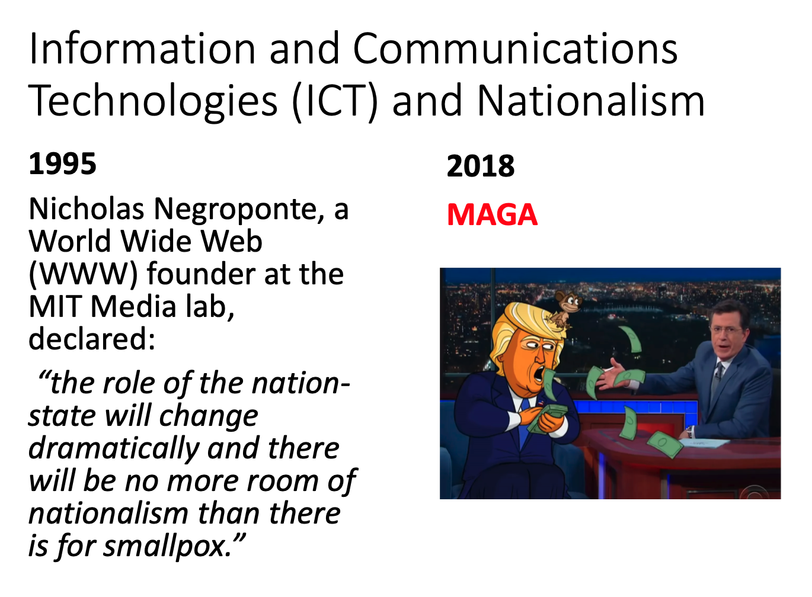

# HIST 419: On Nationalism
### Professor Adi Gordon

On Nationalism was one of those classes that I knew I was going to take after I read the course introduction:

Nationalism – by far the most powerful political idea of the past 250 years – has transformed human history the world over. By positing a new form of human identity, it has liberated and enslaved, built and destroyed. Most importantly it persisted by presenting itself as a natural fact of human life. Studying nationalism, therefore, is an act of self-exploration, whether or not we regard ourselves as bound to the nation. Yet, though nationalism has shaped the modern age, people strongly disagree on its most basic concepts: What are nations? When did they emerge? What is their future? This research seminar will begin with a systematic and comparative study of the key theories of nationalism, seeking to understand both their claims and historical contexts. From this theoretical foundation, the seminar will explore case studies from different epochs and continents. Further: more than focusing on nationalism’s impact on politics, our case studies will illustrate nationalism’s impact on gender norms and class, on religion and philosophy, on culture and the arts. Finally the course will culminate in individual student research projects, consisting of a 20 page paper and a final presentation as part of a mini-conference event.

## WeChat, China, Information and Communication Technologies, and Nationalism: What Happens When Nationalism Goes Digital?

[Link](/pdfs/ict-china-nationalism-paper.pdf) to full pdf.

[Link](/pdfs/ict-china-nationalism-slides.pdf) to summary slides.

Looking back at my paper, the prose could definitely use some work, and I tackled too many big ideas, but overall I think it's an interesting enough paper to display.

Some key ideas:
> To examine how state and ICT mutually inform and interact, we need to first understand nationalism’s drive for modernization. As Gellner argues, “Mankind is irreversibly committed to industrial society, and there- fore to a society whose productive system is based on cumulative science and technology” (39).21 With this commitment to industrialize and modernize, Gellner then advances the inextricable link between industrialization and nationalism, arguing that “All this being so, the age of transition to industrialism was bound, according to our model, also to be an age of nationalism, a period of turbulent re-adjustment, in which either political boundaries, or cultural ones, or both, were being modified, so as to satisfy the new nationalist imperative which now, for the first time, was making itself felt” (40).22

> A central component of the struggle to modernize, as repeatedly identified in the above narrative, is technological development, as noted, “In the European colonies, technology was at once the means by which the colony was established and the pathway to its dismantling”(39).31 As Adria details, “A complex of literacy, a universal postal system, railways, and government subsidies for the postal delivery of newspapers contributed to this conquest (Osborne and Pike 2004). Colonized peoples were conquered through the new economic and cultural technologies of train and telegraph, rather than the older methods of fortress and firepower” (40).32

> For a more precise definition of ‘technological nationalism’, we turn to Maurice Charland, who allegedly coined the term first, and which he defines as “...rhetoric of technological nationalism in anglophone Canada which ascribes to technology the capacity to create a nation by enhancing communication”(197).38 As Charland argues, this rhetoric “...undergirds Canada's official ideology and guides the formulation of federal government policy, at least in the area of broadcasting: the CBC is legitimated in political discourse by the CPR. Furthermore, I will argue that the rhetoric of technological nationalism is insidious, for it ties a Canadian identity, not to its people, but to their mediation through technology” (197).39