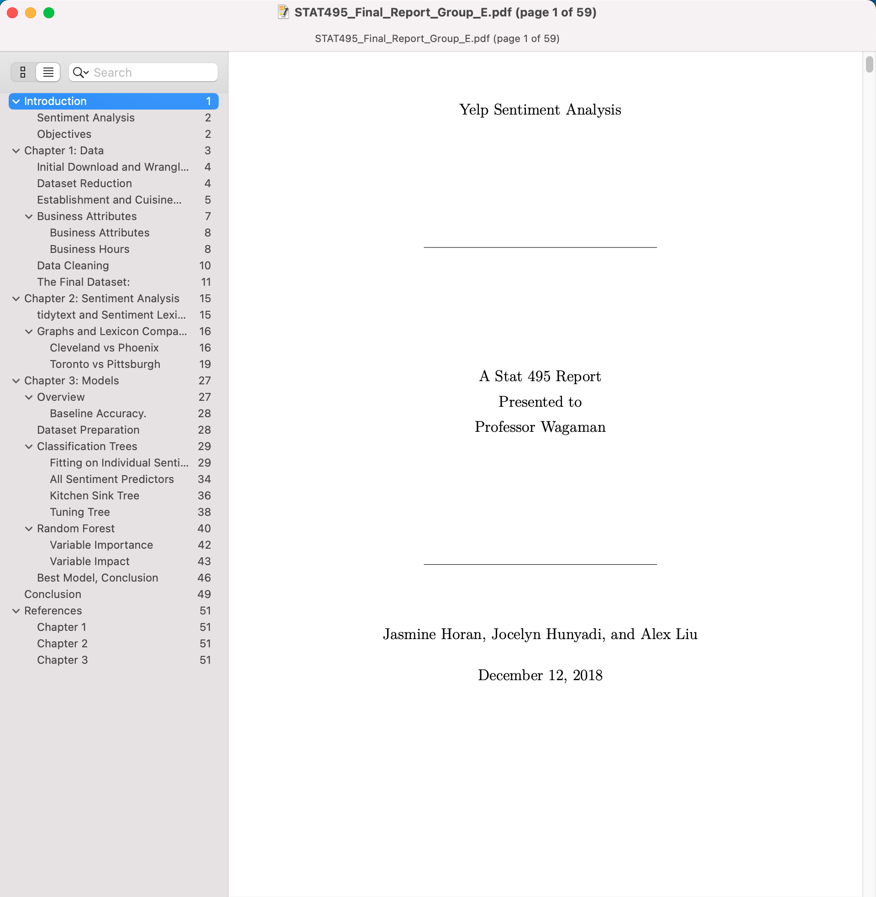

# Yelp Dataset Challenge

For the final project of the Statistics Capstone course at Amherst, I and a
group of two other students decided to take on the 12th Yelp Dataset Challenge.
Our main goal was to predict the `stars_review` response variable, which has 5
levels, 1-5, making it a multi-class classification problem. I focused on
applying and interpreting two machine learning methods we learned in class,
Classification Trees and Random Forests. Unfortunately, after valiant efforts,
even with the new sentiment factors we added, the best model only achieved 3.5%
better accuracy than a baseline majority prediction.

Full pdf of our report: [link](../pdfs/STAT495_Final_Report_Group_E.pdf)

