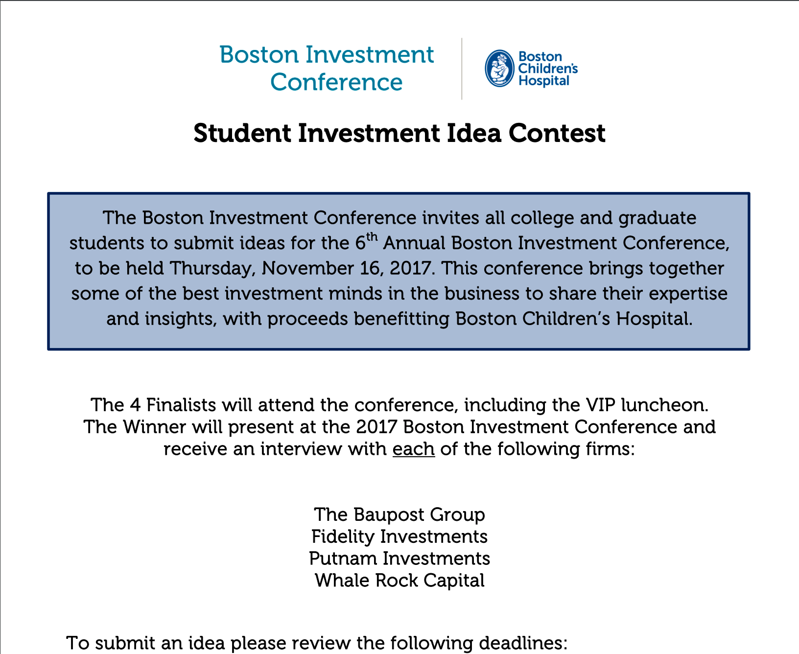
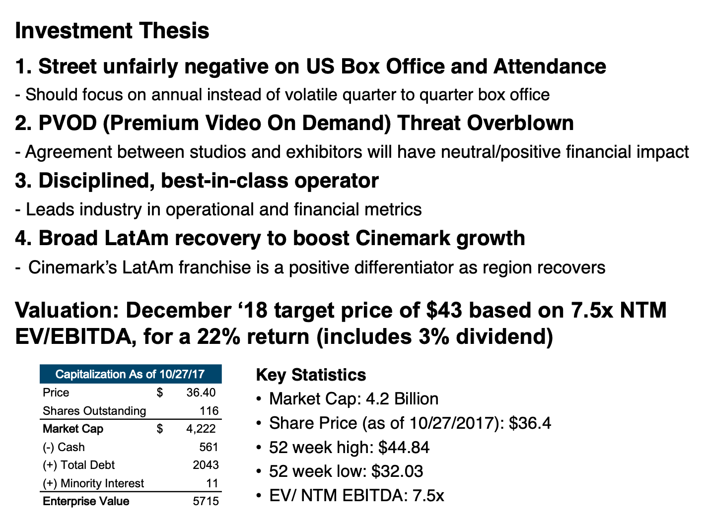
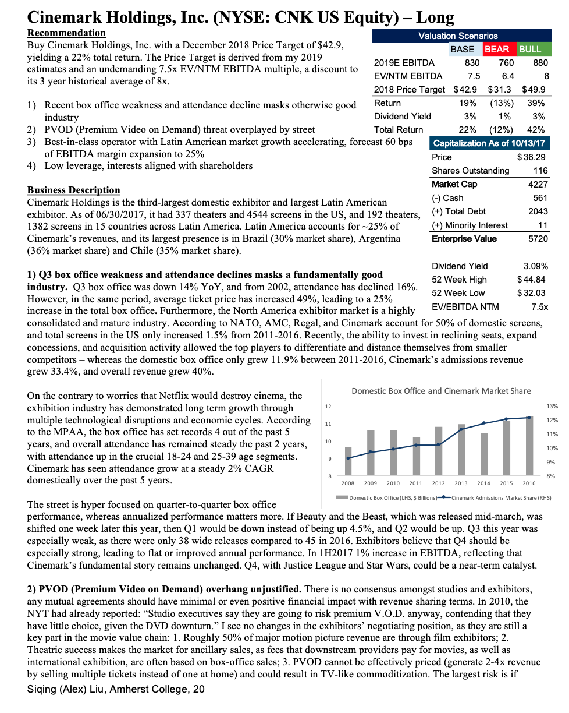

# Boston Investment Conference Pitch: CNK

I made one of 8 semi-finalist places at the Boston Investment Conference's 2017 [Student Investment Idea Competition](http://bostoninvestmentconference.com/wp-content/uploads/2017/06/2017-BIC-Student-Stock-Contest-Flyer_new.pdf), which got me a $3000 ticket to the conference and a chance to see legendary investors like Seth Klarman and Joel Tillinghast give talks. This competition was open to college and graduate students, and I pulled together a pitch for Cinemark Holdings, Inc. (NYSE: CNK US Equity) with the sell-side reports I got from Amherst College's Endowment Office's Bloomberg Subscription.

## Slides

Full pdf of slide deck: [link](../pdfs/Cinemark-Stock-Pitch-BIC.pdf)

## 2 Page Pitch

Full pdf of 2 Page Pitch: [link](../pdfs/Cinemark-Pitch-Slides-BIC.pdf)