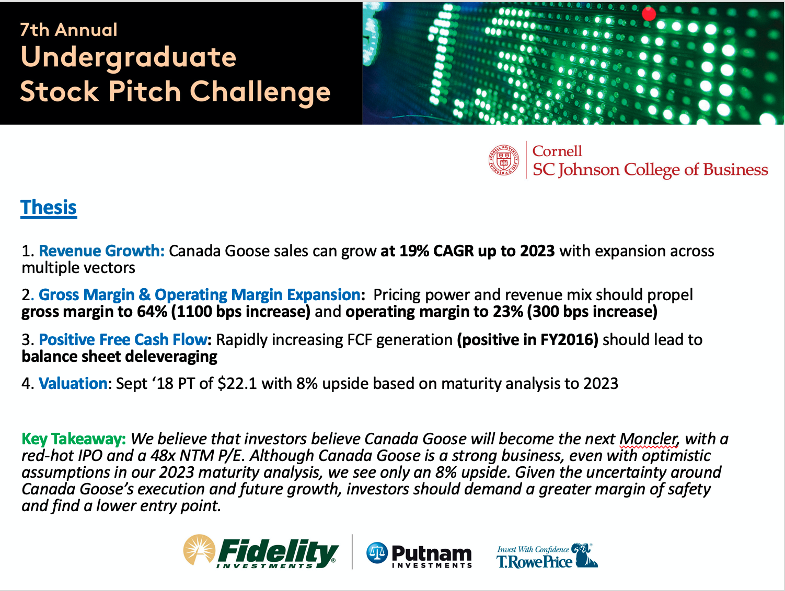
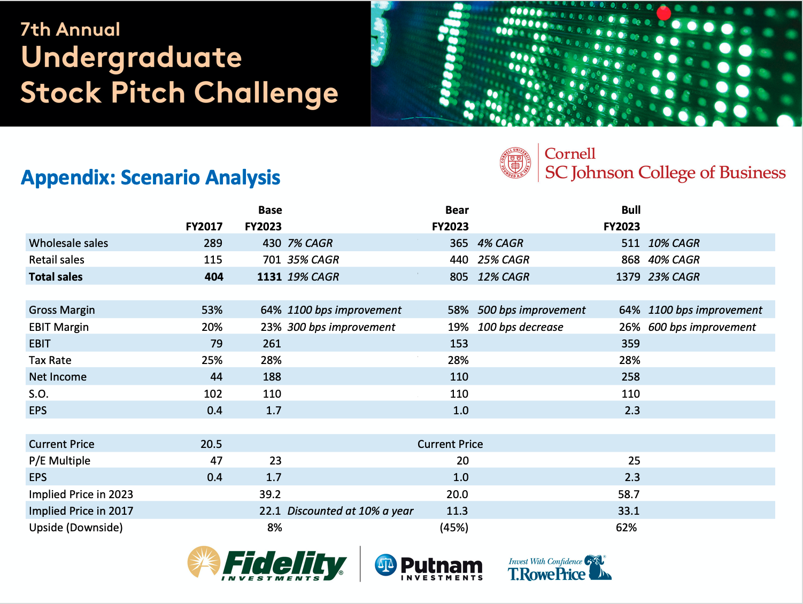

# Cornell Stock Pitch Competition: GOOS

A 3-person team pitch during my Junior (3rd) year, where we pitched a neutral position on Canada Goose (NYSE: GOOS). We didn't make it to the finals, but I think our analysis and our comps at the time were solid. The piece of feedback that stuck with me most is we should've pitched either buy or sell. Not neutral, because that didn't signal confidence or commitment. At the time GOOS was trading at $20, we gave a Sep '18 Price Target of $22.1, which it blew through. GOOS is now (Dec 15 2020）trading at $32, a 60% return (Sep 15 2017 - Dec 15 2020), which is not bad compared to a 48% return from the S&P 500 over the same period.

[(Link)](../pdfs/Amherst_College_GOOS_hopefully_final.pdf) to full pdf of our presentation.

### Thesis Slide:

### Scenario Analysis Slide:
