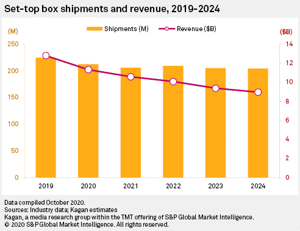
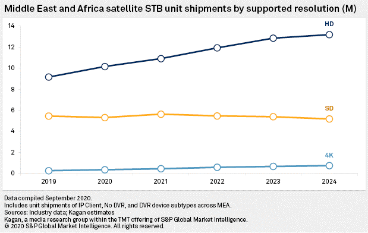
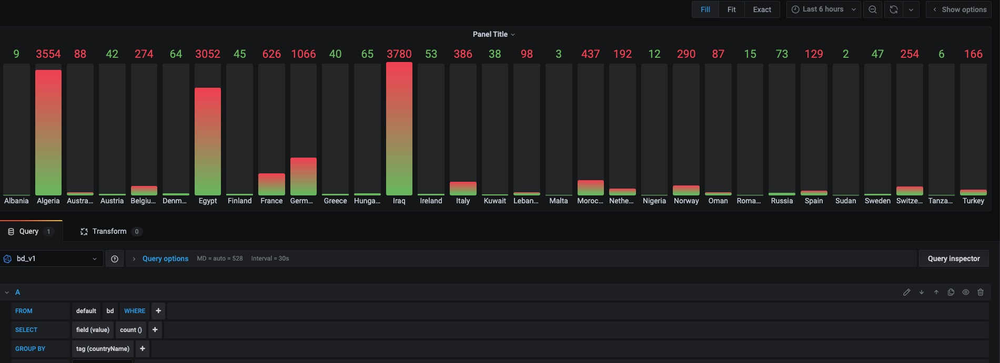
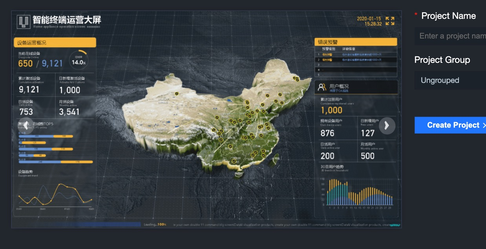
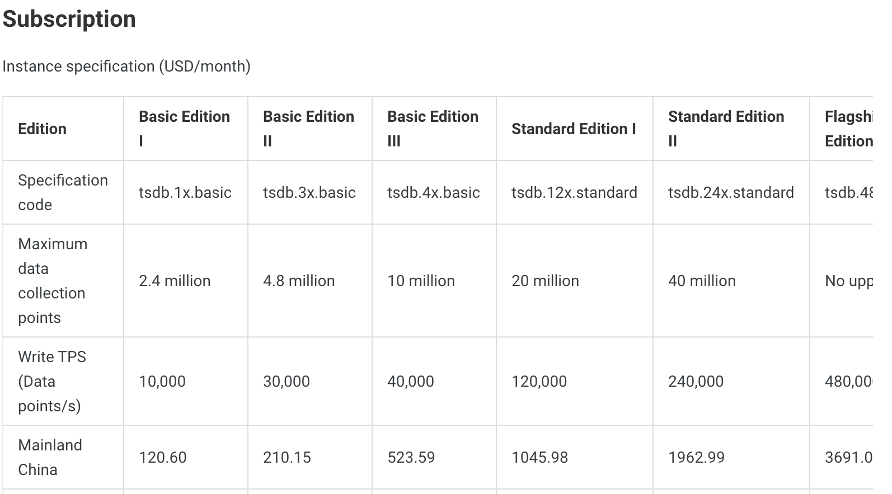
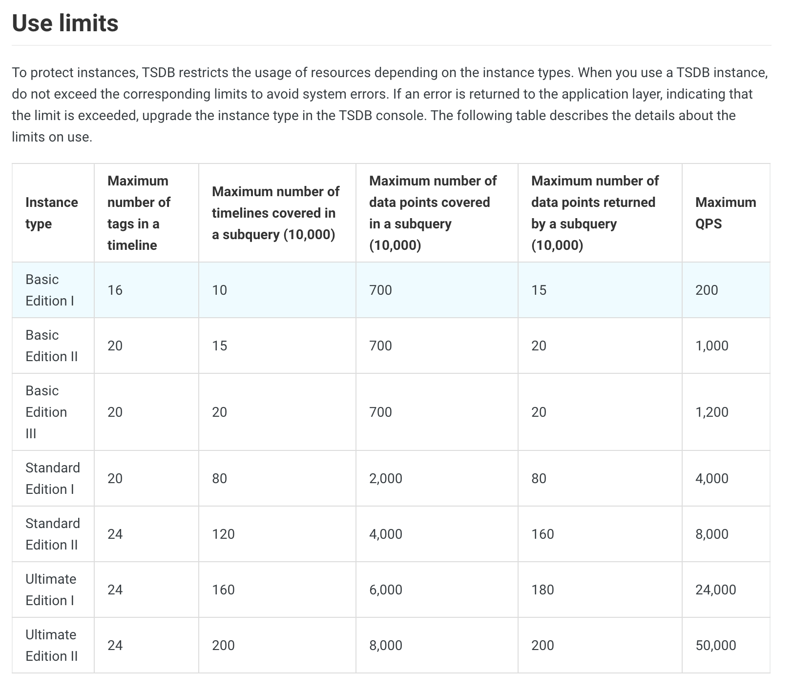

# Time Series and IoT Analytics
## Summary

I helped a startup make an architecture-level shift from a traditional MySQL database to a InfluxDB and Grafana stack. This startup captured viewing data from tens of thousands of Set Top Boxes located in EMEA, and their storage costs and processing times were ballooning dramatically. I conducted research and identified that their business needs were best served by a purpose-built time series database and their rich ecosystem of visualization and processing technologies. Alibaba Cloud's TSDB, based on OpenTSDB, was inadequate for the high-cardinality viewing data the startup was collecting, even after data modeling optimizations. After further research we  found that InfluxDB could overcome this technical roadblock, and after switching, storage size dropped to < 1% of the original MySQL database, queries ran in almost real-time, and Grafana for visualization saved them untold hours of PowerPoint formatting.

## Streams of Data

The startup I was helping had run into a major technical problem. They had pitched a grand vision of collecting viewing information from Set Top Boxes (STBs) to enable better advertising and marketing. The startup's main background was in the embedded software that ran STBs, but now they had over 50,000 STBs sending back viewing data, and they were storing it in a MySQL database. With almost a million rows being written daily, storage was quickly ballooning, but the main problem was that the aggregate statistics they ran using SQL procedures started taking 30+ minutes. The goal was simple. Make their queries faster, ideally real-time, lower their tech costs, and make pretty visualizations automatically.

### A brief aside on the market for STBs

Americans may wonder who in the world is still buying a Set Top Box and paying for cable. The answer is the Middle East and Africa, and they're definitely not paying for cable. Around 10 years ago when I first moved to China, you could get a STB + a satellite dish, which would receive free satellite broadcasts, but also decrypt paid signals, for a couple hundred RMB, or 20-40 dollars. With the China market approaching near saturation, and global shipments declining, Chinese suppliers in this ferociously cost-competitive industry have set their sights on emerging economies where many consumers want access to broadcast entertainment.

While STB shipments are falling globally....

They're growing in the Middle East and Africa

## Time Series Workloads

Specialized technology for time-series data isn't new – I used kdb during an internship, a database where a nanosecond timestamp is a native type. What I found during research, however, is a whole ecosystem of technology optimized specifically to collect, store, graph, and alert enormous volumes of timestamped data. So what makes time-series workloads different, and why are traditional relational databases so bad at handling them?

### OLTP vs. Time Series

Relational databases are very good at OLTP (Online Transaction Processing) workloads. A common model is banking transactions, like transferring money from Account A to Account B. OLTP writes are:[^1]

> - Primarily UPDATES
- Randomly distributed (over the set of primary keys)
- Often transactions across multiple primary keys

However, time-series writes have different characteristics:[^2]

> - Write-mostly is the norm; perhaps 95% to 99% of operations are writes, sometimes higher.
- Writes are almost always sequential appends; they almost always arrive in time order. There is a caveat to this.
- Writes to the distant past are rare. Most measurements are written within a few seconds or minutes after being observed, in the worst case.
- Updates are rare.
- Deletes are in bulk, beginning at the start of history and proceeding in contiguous blocks. Deletes of individual measurements or deletes from random locations in history are rare. Efficient bulk deletes are important; as close to zero cost as possible. Non-bulk deletes need not be optimal.
- Due to the above, an immutable storage format is potentially a good thing. As a further consequence of immutable storage, a predefined or fixed schema may be a problem long-term.

Moreover, when reading time-series:

- Reads are often over a sequential time order.
- Individual values are not particularly important, what's important are instead aggregates, like average, max, sum, count, etc.
- Large time ranges may be requested, so the database must be able to quickly summarize months or years of data.

The workloads time-series databases are optimized for fit our use case exactly. The question was now, which one?

## From OpenTSDB to InfluxDB

There are [at least 33](https://misfra.me/2016/04/09/tsdb-list/) Time-Series Databases out there, but my choice was simplified thanks to the fact that our startup was already committed to Alibaba Cloud (the best for domestic use cases, though still pales in comparison to AWS), and Alibaba Cloud only had two offerings – their in-house TSDB, built on OpenTSDB, and InfluxDB. We at first went with Alibaba TSDB because they took care of many of OpenTSDB's biggest pain points, such as all the configuration and administration to meet production requirements, weird requirements such as requiring a tag parameter, and offered performance and storage improvements.[^3]

OpenTSDB's critical features were:

- Compression which reduces a data point to one to two bytes, whereas in MySQL each data point was taking up around 200 bytes.
- Writes up to 10 million data points per second
- An HTTP API and Java client
- Built-in aggregation functions to summarize data

Immediately, we noticed storage size had dropped to <1% of our original MySQL database, and we quickly moved on to building out a visualization solution using Grafana. What we didn't bank on was OpenTSDB's biggest flaw, it's poor performance with high cardinality datasets. After only a day of test input, queries were taking minutes or just crashing. But first, what is cardinality, and why does it matter for time series databases?

### What is Cardinality?

The mathematical definition of cardinality is the number of elements in a set, but in the world of databases, it refers to the number of unique values for a field or column. For example, if you have a field 'color', and there are possible colors in your dataset are yellow, blue, and green, then that field has a cardinality of 3.

For our use case, we were recording many other high cardinality tags as metadata. This allows a 'metric', or measurement, to be filtered and categorized by tag. For example, we had a tag for the name of the channel, so we can aggregate view time based on whether the channel was Ennehar TV or Al Arabia HD, and we had a tag for the STB's ID, so we could count the number of unique views. Individually, high-cardinality tags don't pose a major issue. However, the cardinality of a time series dataset is determined by the Cartesian product of all input sets. When most metadata values are independent of each other, a quick approximation is the product of each field's cardinality. So if we had 10 devices, and 10 channels, then the cardinality of the dataset would be 10 x 10 = 100.

This becomes a problem because these tags are indexed to allow for fast queries, so how each time series databases handle these indexes directly impacts performance once cardinality grows. 

### Death by High Cardinality

Our problem was that we had multiple high cardinality tags, like location and channel. Surprisingly, Alibaba Cloud TSDB had hard limits on the number of timelines we could write into the database, where each timeline is a unique combination of a metric and is tags. The entry level edition only allowed 2.4 million timelines, and unlimited timelines would've required the Flagship edition, at $3691 a month.[^4] After digging further, we found that Alibaba Cloud TSDB also had Usage Limits for each instance, which cut off queries after certain maximums on number of tags, data points, and timelines, which would significantly complicate scaling.[^5]

Even after attempts to reduce the cardinality of certain tags by changing our data model, like reducing the granularity of location data and standardizing channel names, we were hitting a 100,000 timelines after an hour of data ingestion. Clearly Alibaba Cloud TSDB would be expensive, restrictive, or both with the nature of our use case. After hitting this major roadblock, I decided to take a deeper look at InfluxDB, and felt the type of immense joy you get when some other engineering team has solved the exact problem you've been struggling with.

### InfluxDB, The Cure for Our Ills

As per InfluxDB documentation[^6]

> To support a large number of time series, that is, a very high cardinality in the number of unique time series that the database stores, InfluxData has added the new Time Series Index (TSI). InfluxData supports customers using InfluxDB with tens of millions of time series. InfluxData’s goal, however, is to expand to hundreds of millions, and eventually billions. Using InfluxData’s TSI storage engine, users should be able to have millions of unique time series. The goal is that the number of series should be unbounded by the amount of memory on the server hardware.

After testing out an InfluxDB instance, queries that broken TSDB now ran with delays of only seconds. I originally picked Grafana as our visualization/dashboard solution because it was open-source, had a large, active community, and supported dozens of databases natively.

We finished a lot more work building out scalable endpoints to process and write data to InfluxDB, and getting Grafana and its numerous plugins to work, but they were minor hurdles compared to the high-level architectural choices we made through this process of iteration. Thanks to cloud computing and startups like InfluxData, this startup now had slick, real-time proof-of-concept graphs and maps to show off to investors and potential clients.

A sample of Grafana and the proof-of-concept we delivered 

## A Brief Addendum on Grafana

Originally, the startup wanted to use Alibaba Cloud's custom BI offerings, which offered fancy 3D visualizations:

After trying out a dozen or so frameworks/libraries/tools, I had one lesson drilled into me – none of the features matter you can't get them to work. And to get fix something when its breaks, good documentation and an active community are critical. My experience with Alibaba's documentation and developer community were not ideal, in both English and Mandarin, and I did not want tear my hair out again digging through a labyrinth of incomplete and sometimes incorrect documentation again. Although Grafana wasn't as visually impressive I convinced the startup that they would save themselves immense headaches and costs by using something with complete documentation and an active community.

[^1]: [https://blog.timescale.com/blog/what-the-heck-is-time-series-data-and-why-do-i-need-a-time-series-database-dcf3b1b18563/](https://blog.timescale.com/blog/time-series-data-why-and-how-to-use-a-relational-database-instead-of-nosql-d0cd6975e87c/)

[^2]: [https://www.xaprb.com/blog/2014/06/08/time-series-database-requirements/](https://www.xaprb.com/blog/2014/06/08/time-series-database-requirements/)

[^3]: [https://www.alibabacloud.com/help/doc-detail/113368.htm](https://www.alibabacloud.com/help/doc-detail/113368.htm?spm=a2c63.p38356.b99.10.180ba577yLeUYi)

[^4]: Pricing for Alibaba Cloud TSDB [https://www.alibabacloud.com/help/doc-detail/55693.htm](https://www.alibabacloud.com/help/doc-detail/55693.htm)

[^5]: Usage Limits for Alibaba Cloud TSDB [https://www.alibabacloud.com/help/doc-detail/72709.htm](https://www.alibabacloud.com/help/doc-detail/72709.htm)

[^6]: [https://docs.influxdata.com/influxdb/v1.8/concepts/time-series-index/](https://docs.influxdata.com/influxdb/v1.8/concepts/time-series-index/)