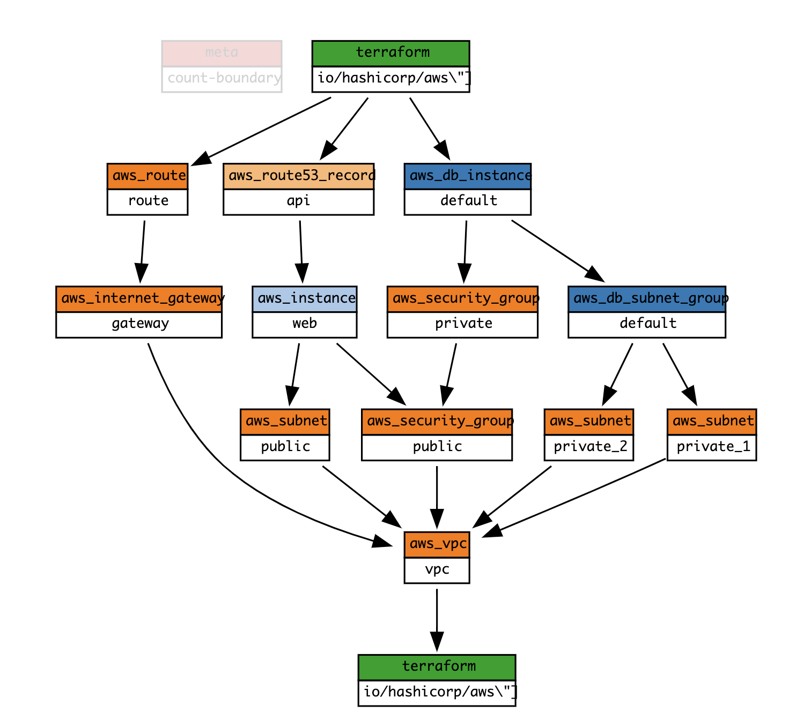
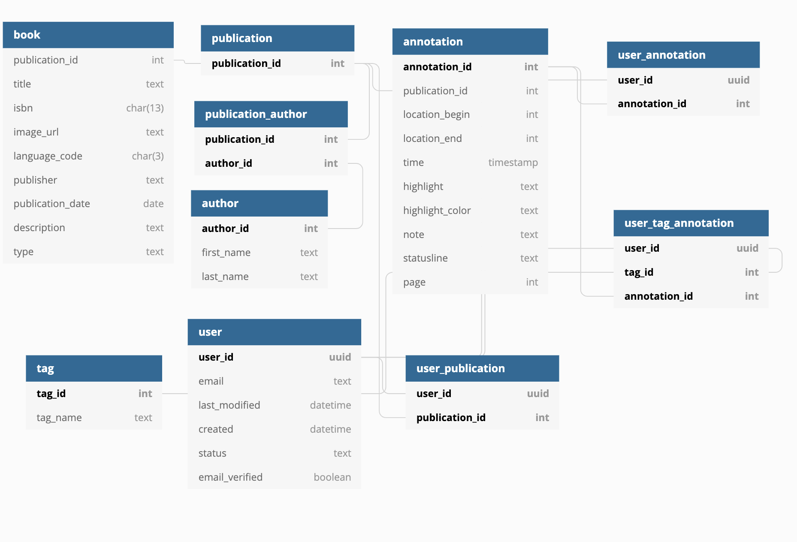
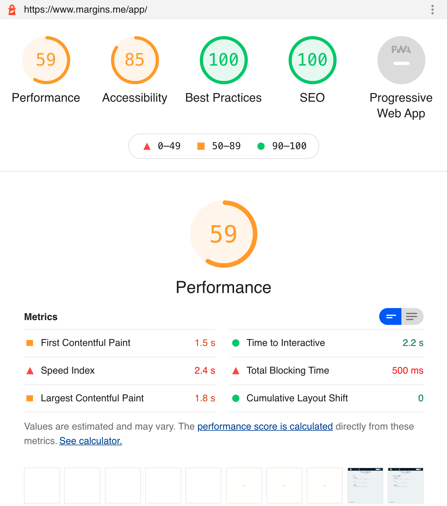
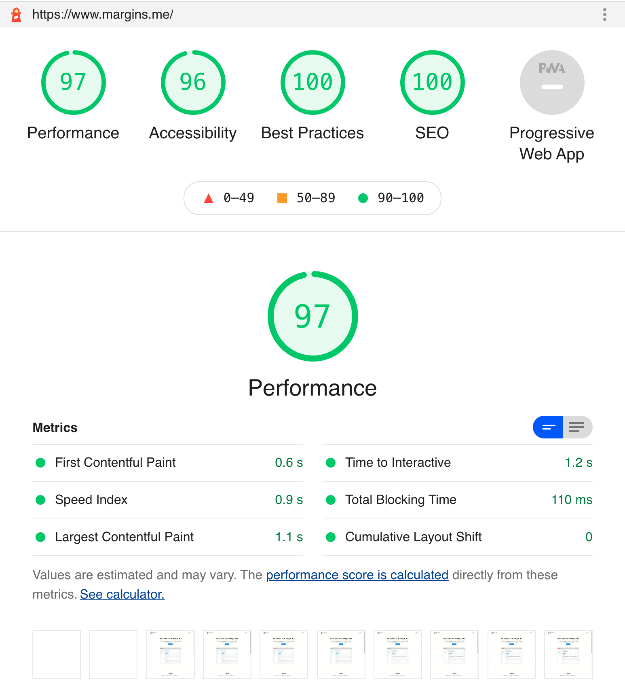

# Overview
## The Problem and the Product

Margins is a focused product built on a modern, production-ready tech stack. I wanted to build a product that I would use myself and would solve the same problem for other users. Top of my mind was a tool to help collect, organize, and display the notes I took when reading. I have notes living in my Kindle, [hypothes.is](http://hypothes.is), pdf files, etc. and want to aggregate, organize, and share my notes. [readwise.io](http://readwise.io) is a popular option, but it doesn't support some of the sources I want, and also charges 8 bucks a month for the full set of features. Given Spotify only charges 10 bucks a month, and Netflix Basic only charges 9 dollars a month, and they actually have to pay for content, I wanted to try and see if I could make my own version of Readwise, but cheaper and with features I want. 

## The Architecture

> Make it work. Make it right. Make it fast. — Kent Beck

> “Architecture is about the important stuff. Whatever that is”. — Martin Fowler, [Who Needs an Architect](https://martinfowler.com/ieeeSoftware/whoNeedsArchitect.pdf)

I made it work. Now I want to explain how I made it right. As Foote and Yoder note, "The architecture that actually predominates in practice has yet to be discussed: the [BIG BALL OF MUD](http://www.laputan.org/mud/mud.html#BigBallOfMud). A [BIG BALL OF MUD](http://www.laputan.org/mud/mud.html#BigBallOfMud) is haphazardly structured, sprawling, sloppy, duct-tape and bailing wire spaghetti code jungle."

I want to demonstrate that I can think through architectural decisions. The best way for me to do so is to show the inner workings of my app and explain how it isn't a Big Ball of Mud.

Each Architecture post in the sidebar documents the key architecture tradeoffs I made for my GraphQL API, Front End, and Serverless Microservices. I'll discuss the benefits and drawbacks of each choice, and why the technology I chose better fit my use case. Tradeoffs discussed include  Apollo vs. Relay, REST vs GraphQL, relational vs. non-relational, Serverless, deployment tools, and more.

## Stack Summary

## GraphQL API Overview [(Github)](https://github.com/alexliusq/margins-services/tree/master/graphql-api)

If you want to get a hello: [https://api.margins.me/test](https://api.margins.me/test)

SSL Labs B Grade: [https://www.ssllabs.com/ssltest/analyze.html?d=api.margins.me](https://www.ssllabs.com/ssltest/analyze.html?d=api.margins.me)

Security Headers B Grade: [https://securityheaders.com/?q=api.margins.me&followRedirects=on](https://securityheaders.com/?q=api.margins.me&followRedirects=on)

API infrastructure deployed and managed with Terraform, [link](https://github.com/alexliusq/margins-services/blob/master/graphql-api/terraform/main.tf) to full config file.

- RDS db.t2.micro instance, PostgreSQL 10.12
    - Security enforced at the data level with RBAC (Role Based Access Control) and Row Level Security
    - [Link](https://github.com/alexliusq/margins-services/blob/master/graphql-api/db/init/00-schema.sql) to full schema

    

    - Plan to Migrate to Aurora
- EC2 t2.micro instance, running Docker. Used Docker Compose to deploy.
    - Express (Dockerized)
        - Primarily a GraphQL Server.
        - PostGraphile: [an amazing open source library](https://www.graphile.org/postgraphile/) that I chose over Hasura, which programmatically generates a Relay-compliant GraphQL server that can easily be run as a library in an Express Server
        - Created JWKs to allow server-side applications to sign their own JWTs and authenticate to the server.
    - Nginx (Dockerized)
        - Right now a reverse proxy, also chosen for potential load balancing without paying for an AWS ELB instance
        - TLS/SSL certificates thanks to [Let's Encrypt](https://letsencrypt.org/)

## Front End Overview [(Github)](https://github.com/alexliusq/margins-me-frontend)

- Netlify: React + Antd + Emotion + Apollo + Gatsby
    - Antd because Material UI is kind of ugly and I quite like the interfaces of many Ant products, like GaoDe, Alipay, etc.
    - Apollo because although their documentation could be improved, Relay's documentation is worse. Good enough to be used by AWS as part of their client side framework Amplify. Client-side caching, though a pain to implement, improves performance significantly.
    - Gatsby because it's a static site generator that makes sites blazingly fast thanks to out-of-the-box optimizations like prefetching and code-splitting.

### React SPA (/app) Lighthouse Score:

#### Landing Page Lighthouse Score:

## Serverless Microservices Overview [(Github)](https://github.com/alexliusq/margins-services/tree/master/lambdas)

All Lambdas deployed using AWS SAM, [link](https://github.com/alexliusq/margins-services/blob/master/lambdas/template.yaml) to template file. Written in TypeScript.

- AWS SES + S3 + Lambda
    - SES to receive emails at kindle@margins.me. Lambda to check if email is registered, if so, SES writes email to S3, S3 triggers a Lambda to parse the Kindle html attachment, convert notes into JSON, and POST them to GraphQL API.
    - Wrote package to extract the Kindle attachment using [MailParser](https://mailparser.io/) and parsed the html using [Cheerio](https://cheerio.js.org/), a server-side jQuery library.
    - AWS SAM to locally test and deploy Lambda functions, (why I chose SAM over the Serverless Framework).
- AWS Cognito: Identity-as-a-Service, far cheaper alternative to Auth0. Every security expert says don't roll your own crypto, I think the same applies to my use case for Identity. I don't want to deal with different [Authentication Challenge flows](https://docs.aws.amazon.com/cognito/latest/developerguide/amazon-cognito-user-pools-authentication-flow.html)
    - AWS Lambda: Post-Confirmation trigger to add user info + onboarding to database
- AWS Route53: DNS